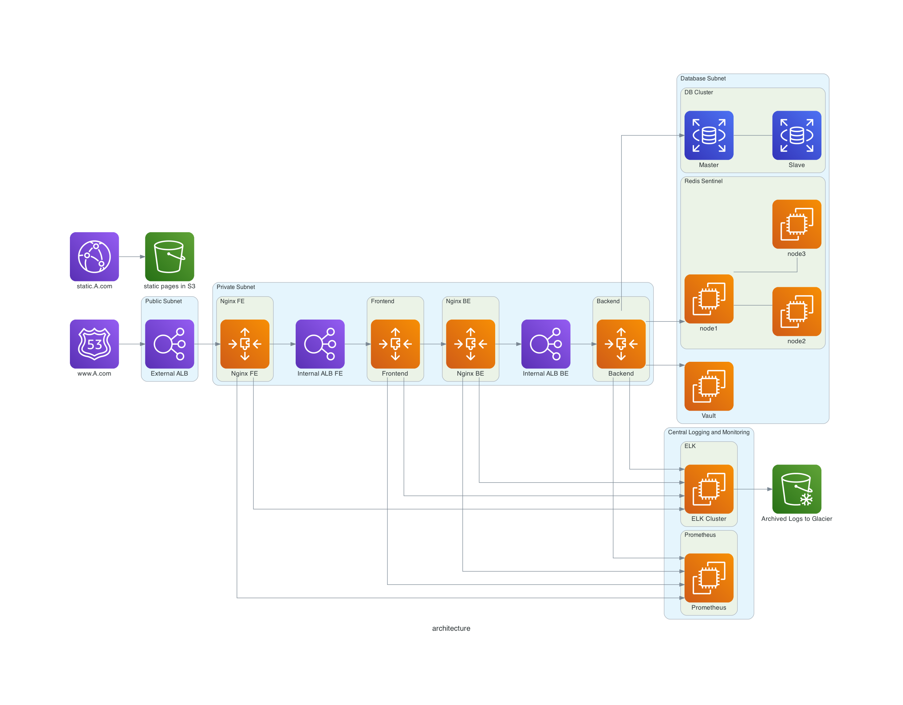

# Architecture Diagrams as Code

##  Prerequisites
### python version > 3.6.x  
### install [graphviz](https://graphviz.org/)   
On mac: brew install graphviz  
on Windows: choco install graphviz    
### install digrams:  
pip install diagrams  

## How to execute
python diagram.py  

You will see architecture.png in your current working directory

## Ignore the warning. They won't effect the way labels are marked  

 
